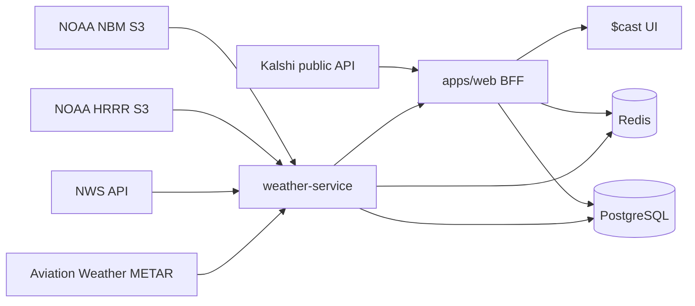

# $cast

Weather market intelligence.

$cast is a read-only analytics web app for Kalshi Climate Daily Temperature and Hourly Temperature markets. It compares live public Kalshi market data with NOAA-based probabilistic weather estimates, then calculates conservative allocation recommendations across eligible positive-edge opportunities.

It does not place trades, request Kalshi credentials, connect to accounts, simulate paper trading, or hold funds.

## Quick Start

```bash
npm install
cp .env.example .env
npm run db:migrate
npm run db:seed
npm run dev
```

Full local stack:

```bash
make dev
```

or:

```bash
npm run dev:full
```

## Required Commands

```bash
npm install
docker compose up --build
npm run dev
npm run test
npm run test:e2e
npm run lint
npm run typecheck
npm run db:migrate
npm run db:seed
```

Production deployment notes are in [DEPLOYMENT.md](./DEPLOYMENT.md).

## Architecture

```text
apps/web
  Next.js 15 App Router UI, BFF API routes, Prisma access, market ingestion,
  allocation engine, pricing/fee logic, TanStack Query client views.

apps/weather-service
  FastAPI service for NOAA/NWS/METAR ingestion, forecast blending, Monte Carlo
  probability distributions, source links, and refresh endpoints.

packages/shared
  Shared TypeScript types and deterministic domain utilities:
  normalization, order-book fills, fee estimates, edge, allocation, simulations.

packages/ui
  Reusable UI primitives styled with Tailwind-compatible classes.

postgres
  Auditable market, forecast, probability, source, order-book, allocation, and
  refresh logs.

redis
  Request cache, refresh de-duplication, stale-data tracking.
```



## Retention and Storage Control

The Docker stack includes a `retention-worker` service. It runs every hour by default and deletes old database/cache records according to `.env.example` retention settings. It also prunes old GRIB files from the shared `grib-cache` Docker volume.

Useful commands:

```bash
docker system df
docker system df -v
docker compose logs -f retention-worker
docker compose run --rm retention-worker npm run retention:cleanup
```

Important environment settings:

```text
RETENTION_CLEANUP_ENABLED=true
RETENTION_DRY_RUN=false
RETENTION_WORKER_INTERVAL_SECONDS=3600
EDGE_SNAPSHOT_RETENTION_DAYS=7
PROBABILITY_SNAPSHOT_RETENTION_DAYS=7
FORECAST_RUN_RETENTION_DAYS=3
OBSERVATION_RETENTION_DAYS=7
REFRESH_LOG_RETENTION_DAYS=14
ALLOCATION_RUN_RETENTION_DAYS=30
GRIB_CACHE_RETENTION_HOURS=24
```

Use `RETENTION_DRY_RUN=true` to log what would be removed without deleting data. The `/status` page shows row counts, retention policy, and the latest cleanup result.

## Live and Demo Modes

Live mode is the default. If public network calls fail during development, the app falls back to clearly labeled demo fixtures. Demo output is never labeled as live edge and is never mixed with live data.

## Safety Rules

The allocation engine fails closed. A market is excluded from recommendations when settlement station mapping, contract parsing, forecast freshness, fee estimates, order-book liquidity, model confidence, source data, or probability validity cannot be verified.

Footer disclosure used in the app:

```text
$cast is an independent analytics tool. Market data is sourced from Kalshi. $cast is not affiliated with, endorsed by, or sponsored by Kalshi. Forecasts and allocation estimates are probabilistic and may be wrong.
```
